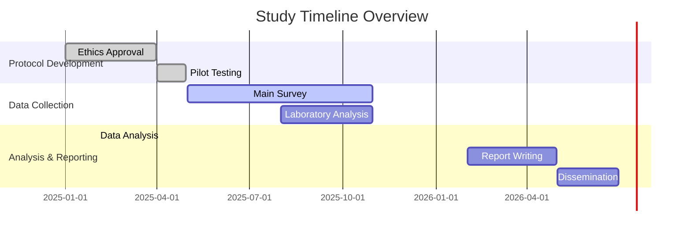

# Allergy Epidemiology Research Protocol

## 📋 **SIMS&RH Tumkur, Karnataka - Comprehensive Allergy Study**

[](https://github.com/hssling/Allergy_Epidemiology_Microbiome_Microplastics_Research_Protocol)
[](LICENSE)
[](Protocol/Main_Protocol.md)

---

## 🎯 **Study Overview**

This repository contains a comprehensive epidemiological research protocol for studying allergic diseases in Tumkur district, Karnataka, India. The study focuses on prevalence, distribution, phenotypes, determinants, temporal and spatial associations of allergies with special emphasis on emerging environmental factors including microbiome composition and microplastic exposure.

### **Key Research Areas:**
- 🦠 **Microbiome Analysis** - Gut microbiota associations with allergic diseases
- 🥤 **Microplastic Exposure** - Environmental microplastic impact on allergies
- 🏥 **Quality of Life** - Comprehensive assessment of allergy burden
- 💊 **Treatment Perceptions** - Understanding healthcare-seeking behavior
- 🧬 **Comorbidities** - Associated health conditions analysis

---

## 📁 **Repository Structure**

```
Allergy_Epidemiology_Microbiome_Microplastics_Research_Protocol/
├── 📄 Protocol/                          # Main protocol documents
│   ├── Main_Protocol.md                  # Complete research protocol
│   ├── Questionnaires/                   # Data collection instruments
│   ├── Data_Collection_Forms/            # Clinical examination forms
│   ├── Ethical_Documents/                # Ethics committee submissions
│   ├── Analysis_Plan/                    # Statistical methodology
│   ├── Timeline_Budget/                  # Study timeline & budget
│   ├── SOPs/                            # Standard operating procedures
│   ├── Consent_Forms/                    # Participant consent documents
│   ├── Data_Management/                  # Data handling protocols
│   ├── Dissemination/                    # Publication & dissemination plan
│   ├── Translation_Plan.md              # Kannada translation strategy
│   ├── Sample_Size_Calculation/          # Detailed sample size calculations
│   ├── Data_Analysis_Scripts/            # R analysis scripts
│   ├── Data_Tables/                      # Data dictionaries & templates
│   ├── Data_Entry/                       # Data entry tools & instructions
│   └── Results_Template/                 # Results reporting templates
├── 🔧 Conversion Tools/                  # Document conversion utilities
├── 📊 Output_DOCX/                       # Converted Microsoft Word files
└── 📖 Documentation/                     # Additional guides & manuals
```

---

## 🚀 **Quick Start**

### **For Researchers & Ethics Committees:**
1. **Review Main Protocol:** Start with [`Protocol/Main_Protocol.md`](Protocol/Main_Protocol.md)
2. **Check Ethics Documents:** Review [`Protocol/Ethical_Documents/`](Protocol/Ethical_Documents/)
3. **Examine Data Collection:** See [`Protocol/Questionnaires/`](Protocol/Questionnaires/) and [`Protocol/Data_Collection_Forms/`](Protocol/Data_Collection_Forms/)

### **For Data Analysts:**
1. **Analysis Scripts:** Use [`Protocol/Data_Analysis_Scripts/analysis_script.R`](Protocol/Data_Analysis_Scripts/analysis_script.R)
2. **Data Dictionary:** Reference [`Protocol/Data_Tables/data_dictionary.csv`](Protocol/Data_Tables/data_dictionary.csv)
3. **Results Template:** Follow [`Protocol/Results_Template/study_results_template.Rmd`](Protocol/Results_Template/study_results_template.Rmd)

### **For Study Coordinators:**
1. **SOPs:** Follow [`Protocol/SOPs/Standard_Operating_Procedures.md`](Protocol/SOPs/Standard_Operating_Procedures.md)
2. **Data Entry:** Use [`Protocol/Data_Entry/`](Protocol/Data_Entry/) tools
3. **Timeline & Budget:** Review [`Protocol/Timeline_Budget/`](Protocol/Timeline_Budget/)

---

## 📋 **Study Specifications**

| **Aspect** | **Details** |
|------------|-------------|
| **Study Design** | Cross-sectional epidemiological with nested case-control |
| **Target Population** | Residents of Tumkur district aged 5-65 years |
| **Sample Size** | 1,200 participants (470 main + 276 microbiome + 298 microplastic) |
| **Duration** | 16 months (March 2025 - June 2026) |
| **Budget** | ₹25,00,000 (approximately $30,000 USD) |
| **Institution** | Shridevi Institute of Medical Sciences & Research Hospital |
| **Location** | Tumkur district, Karnataka, India |
| **Languages** | English (primary), Kannada (translations planned) |

---

## 🔬 **Research Methodology**

### **Data Collection Methods:**
- **Survey Administration:** Structured questionnaires
- **Clinical Examination:** Standardized allergy assessments
- **Laboratory Analysis:** Microbiome sequencing & microplastic quantification
- **Spatial Data:** GPS coordinates & environmental mapping

### **Analysis Framework:**
- **Descriptive Statistics:** Prevalence, distribution, demographics
- **Bivariate Analysis:** Risk factor identification
- **Multivariate Models:** Logistic regression with complex sampling
- **Microbiome Analysis:** Alpha/beta diversity, differential abundance
- **Spatial Analysis:** GIS mapping, Moran's I, hotspot analysis
- **Quality of Life:** Multi-dimensional assessment

### **Quality Assurance:**
- Double data entry with validation
- Regular supervision and monitoring
- Inter-observer reliability assessment
- Ethical compliance throughout

---

## 📊 **Key Documents**

### **Essential Reading:**
- [**Main Protocol**](Protocol/Main_Protocol.md) - Complete research methodology
- [**Ethics Submission**](Protocol/Ethical_Documents/Ethics_Committee_Submission.md) - Regulatory compliance
- [**SOP Manual**](Protocol/SOPs/Standard_Operating_Procedures.md) - Study procedures
- [**Analysis Plan**](Protocol/Analysis_Plan/Data_Analysis_Plan.md) - Statistical methods

### **Data Management:**
- [**Data Dictionary**](Protocol/Data_Tables/data_dictionary.csv) - Variable definitions
- [**Entry Instructions**](Protocol/Data_Entry/data_entry_instructions.md) - Data collection guidelines
- [**Analysis Script**](Protocol/Data_Analysis_Scripts/analysis_script.R) - R analysis code

### **Templates & Tools:**
- [**Consent Forms**](Protocol/Consent_Forms/Participant_Consent_Form.md) - Participant agreements
- [**Results Template**](Protocol/Results_Template/study_results_template.Rmd) - Reporting framework
- [**Conversion Tools**](README_Conversion.md) - Document format utilities

---

## 🛠 **Technical Requirements**

### **Software Dependencies:**
- **R (4.0+)** with packages: tidyverse, survey, vegan, ggplot2, sf
- **Pandoc** for document conversion
- **Git** for version control
- **Microsoft Office** or **LibreOffice** for document editing

### **Data Formats:**
- **Markdown (.md)** - Primary documentation format
- **CSV** - Data templates and dictionaries
- **R Scripts (.R)** - Analysis code
- **R Markdown (.Rmd)** - Reproducible reports

---

## 📈 **Study Timeline**



---

## 🤝 **Contributing**

### **How to Contribute:**
1. **Fork** the repository
2. **Create** a feature branch (`git checkout -b feature/amendment`)
3. **Commit** changes (`git commit -m 'Add amendment'`)
4. **Push** to branch (`git push origin feature/amendment`)
5. **Create** Pull Request

### **Guidelines:**
- Follow existing document structure
- Maintain Markdown formatting
- Include rationale for changes
- Update version numbers appropriately

---

## 📄 **License & Usage**

### **License:**
This research protocol is licensed under the **MIT License** - see [LICENSE](LICENSE) file for details.

### **Usage Rights:**
- **Academic Use:** Free for educational and research purposes
- **Modifications:** Allowed with attribution
- **Commercial Use:** Contact authors for permissions
- **Citation:** Please cite this repository in publications

### **Attribution:**
```
HSSLing. (2025). Allergy Epidemiology Research Protocol: SIMS&RH Tumkur Study.
https://github.com/hssling/Allergy_Epidemiology_Microbiome_Microplastics_Research_Protocol
```

---

## 📞 **Contact Information**

### **Principal Investigator:**
- **Name:** Dr. Siddalingaiah H S
- **Designation:** Professor, Community Medicine
- **Institution:** Shridevi Institute of Medical Sciences & Research Hospital
- **Location:** Tumkur, Karnataka, India
- **Email:** hssling@yahoo.com
- **Phone:** 8941087719

### **Study Coordinator:**
- **Name:** [Study Coordinator Name]
- **Email:** [coordinator email]
- **Phone:** [contact number]

### **GitHub Issues:**
For technical questions, protocol clarifications, or suggestions:
- [Create GitHub Issue](https://github.com/hssling/Allergy_Epidemiology_Microbiome_Microplastics_Research_Protocol/issues)

---

## 🔍 **Repository Status**

### **Current Version:** v1.0 (March 2025)
- ✅ Complete research protocol
- ✅ Ethics committee ready
- ✅ Data collection tools prepared
- ✅ Analysis framework established
- ✅ Documentation comprehensive

### **Next Steps:**
- Ethics committee submission
- Funding application
- Pilot study implementation
- Full-scale data collection

---

## 🙏 **Acknowledgments**

### **Funding:**
- Institutional support from Shridevi Institute of Medical Sciences & Research Hospital
- Research grants and collaborative funding

### **Contributors:**
- Research team members
- Ethics committee advisors
- Technical consultants
- Community partners

### **Open Source Tools:**
- R Statistical Software
- RStudio IDE
- Pandoc document converter
- Git version control
- GitHub platform

---

## 📚 **Additional Resources**

### **Related Research:**
- [WHO ARIA Guidelines](https://www.who.int/tools/allergy-rhinitis-and-its-impact-on-asthma)
- [ISAAC Study](https://isaac.auckland.ac.nz/)
- [Indian Allergy Research](https://www.IndianChest.org)

### **Training Materials:**
- [Research Ethics in India](https://www.icmr.nic.in)
- [Epidemiological Methods](https://www.epidemiolog.net)
- [R for Health Research](https://www.r4h.org)

---

**⭐ If this repository is helpful for your research, please consider starring it on GitHub!**

*Last updated: March 2025*
